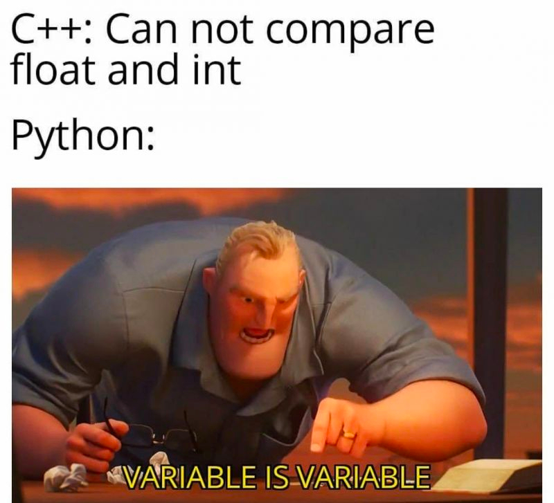

# C++ custom Operators

In C++ you can define custom operators for your class using operator overloading. This allows you to define the behavior of operators when applied to objects of your class.

You might want to implement some of the following operators for your class:

- arithmetic operators: `+`, `-`, `*`, `/`, `%`
- comparison operators: `==`, `!=`, `<`, `>`, `<=`, `>=`
- spaceship operator: `<=>` (C++20)
- unary operators: `+`, `-`, `*`, `&`, `!`, `~`, `++`, `--`
- compound assignment operators: `+=`, `-=`, `*=`, `/=`, `%=`, `<<=`, `>>=`, `&=`, `|=`, `^=`
- prefix increment and decrement operators: `++`, `--`
- postfix increment and decrement operators: `++`, `--`
- subscript operator: `[]`
- stream insertion and extraction operators: `<<`, `>>`

```c++
#include <iostream>

struct Vector2i {
  int x, y;
  Vector2i() : x(0), y(0) {}
  Vector2i(int x, int y) : x(x), y(y) {}
  // arithmetic operators
  Vector2i operator+(const Vector2i& other) const {
    return {x + other.x, y + other.y};
  }
  Vector2i operator-(const Vector2i& other) const {
    return {x - other.x, y - other.y};
  }
  Vector2i operator*(int scalar) const {
    return {x * scalar, y * scalar};
  }
  Vector2i operator/(int scalar) const {
    return {x / scalar, y / scalar};
  }
  Vector2i operator*(const Vector2i& other) const {
    return {x * other.x, y * other.y};
  }
  Vector2i operator/(const Vector2i& other) const {
    return {x / other.x, y / other.y};
  }
  // comparison operators
  bool operator==(const Vector2i& other) const {
    return x == other.x && y == other.y;
  }
  bool operator!=(const Vector2i& other) const {
    return !(*this == other);
  }
  // spaceship operator C++20
  // useful when you want to compare two objects or
  //   use it in std::map or std::set
  auto operator<=>(const Vector2i& other) const {
    if (x < other.x && y < other.y) return -1;
    if (x == other.x && y == other.y) return 0;
    return 1;
  }

  // unary operators
  Vector2i operator-() const {
    return Vector2i(-x, -y);
  }
  // compound assignment operators
  Vector2i& operator+=(const Vector2i& other) {
    x += other.x;
    y += other.y;
    return *this;
  }
  Vector2i& operator-=(const Vector2i& other) {
    x -= other.x;
    y -= other.y;
    return *this;
  }
  Vector2i& operator*=(int scalar) {
    x *= scalar;
    y *= scalar;
    return *this;
  }
  Vector2i& operator/=(int scalar) {
    x /= scalar;
    y /= scalar;
    return *this;
  }
  // prefix increment and decrement operators
  Vector2i& operator++() {
    x++;
    y++;
    return *this;
  }
  Vector2i& operator--() {
    x--;
    y--;
    return *this;
  }
  // postfix increment and decrement operators
  Vector2i operator++(int) {
    Vector2i temp = *this;
    ++*this;
    return temp;
  }
  Vector2i operator--(int) {
    Vector2i temp = *this;
    --*this;
    return temp;
  }
  // subscript operator
  int& operator[](int index) {
    return index == 0 ? x : y;
  }
  // stream insertion operator
  friend std::ostream& operator<<(std::ostream& stream, const Vector2i& vector) {
    return stream << vector.x << ", " << vector.y;
  }
  // stream extraction operator
  friend std::istream& operator>>(std::istream& stream, Vector2i& vector) {
    return stream >> vector.x >> vector.y;
  }
};
```



## Special operators

You can create special operators for your class such as:

- `()` operator: function call operator
- `->` operator: member access operator
- 'new' and 'delete' operators: memory allocation and deallocation operators

A nice usecase for function call operator is to create a functor, a class that acts like a function.

```c++
#include <iostream>

struct Adder {
  int operator()(int a, int b) const {
    return a + b;
  }
};

int main() {
  Adder adder;
  std::cout << adder(1, 2) << std::endl; // 3
  return 0;
}
```

The `->` operator is used to overload the member access operator. It is used to define the behavior of the arrow operator `->` when applied to objects of your class.

```c++
#include <iostream>

struct Pointer {
  int value;
  int* operator->() {
    return &value;
  }
};

int main() {
  Pointer pointer;
  pointer.value = 42;
  std::cout << *pointer << std::endl; // 42
  return 0;
}
```

You might want to overload the `new` and `delete` operators to define the behavior of memory allocation and deallocation for your class. Specially to track memory usage or to implement a custom memory pool. Or even overload it globally to track memory usage for the whole program.

```c++
#include <iostream>
#include <cstdlib>

// declare the alloc counter
int alloc_counter = 0;

void* operator new(std::size_t size) {
  alloc_counter ++;
  return std::malloc(size);
}

void operator delete(void* ptr) noexcept {
  std::free(ptr);
  alloc_counter--;
}

int main() {
  int* ptr = new int;
  std::cout << "alloc_counter: " << alloc_counter << std::endl; // 1
  delete ptr;
  std::cout << "alloc_counter: " << alloc_counter << std::endl; // 0
  return 0;
}
```