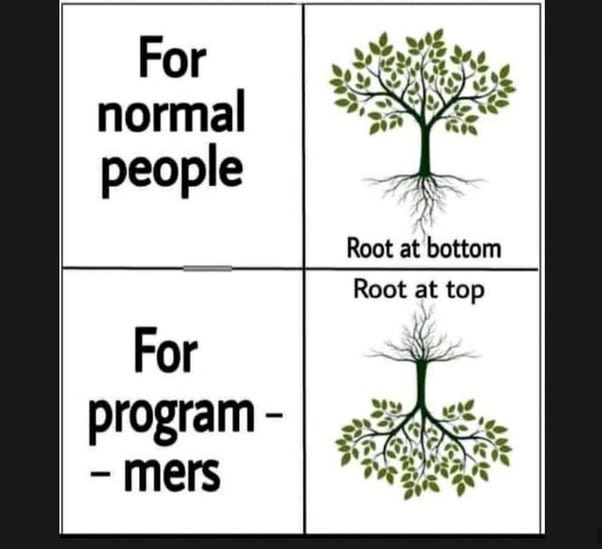

# Trees

- It is a connected graph what have no cycles;
- Has a single path between any two vertices;
- A tree with N vertices has N-1 edges;

## Traversing a Binary Tree

There are mostly three ways to explore a binary search tree, they generate different outputs:

- **In-order**: Left, Root, Right;
- **Pre-order**: Root, Left, Right;
- **Post-order**: Left, Right, Root;

## Binary Search Trees

A binary search tree is a binary tree:

- Each node has at most two children;
- The left child is less than the parent;
- The right child is greater than the parent;
- The left and right subtrees are also binary search trees;

In a binary search tree, the search complexity is `O(log(n))` in a balanced tree. But it can be `O(n)` if not balanced.

Check the animations on https://visualgo.net/en/bst.

### AVL Trees

WiP.